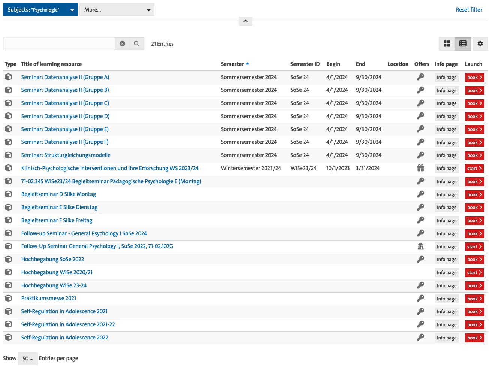

## Description of the situation and equipment of the university

Teaching is a central pillar of any university and in particular at the University of Hamburg with its motto: "Der Forschung, Der Lehre, Der Bildung" ("To research, to teach, to educate and form").
In winter semester 2022/2023, more than 40,000 students (including doctoral students and students on academic leave) were enrolled at University of Hamburg in 75 bachelor's programs and 89 master's programs (for details, see [facts and figures on the university homepage](https://www.uni-hamburg.de/en/uhh/profil/fakten.html)).
It becomes evident that this involves a lot of teaching and therefore time that is spent to create learning resources.
The University of Hamburg provides platforms that support the development and distribution of teaching materials within the university.

Since 2009, the University of Hamburg uses , a teaching and learning platform for comprehensive eLearning courses.
OpenOlat is the teaching and learning platform for comprehensive digital teaching offerings.
OpenOlat supports university teacher in daily tasks and workflows with tools for information provision, event organization and communication.
It is particularly suitable for supplementing courses with a wide range of learning and exercise materials and for using digital examination formats.

To examine, the effectiveness of OpenOlat for the implemenatarion of FAIR principles and reproducibilty, we considered all entries assigned to the Institute of Psychology at the Department for Psychology and Human Movement Science.
At the time of writing this proposal, for this institution OpenOlat listed 21 entries in total (see @fig-open-olat).
Of these 21 entries, 8 entries (ca. 40%) included relevant metadata, like the semester when the course took place.
Strikingly, only 2 of 21 (ca. 10%) of the learning resources were available without access limitations (for example, password protection with an access code, indicated by the  icon).
While it is possible that different users get access to different resources (for example, students might have access to more learning resources than staff), it is probably fair to say to say that only a minority of learning resources are readily available for reuse and extension.
In this example, those materials that are available are typically slides in PDF format.
While the accessibility of learning resources is always betters than no accessibility, opportunities for easy reuse and extensions are limited with PDF format.
Together, this example illustrates the broader point made in the project background that learning resources are not readily available and if they are available, come in formats that are limited with respect to reuse and extension.

{#fig-open-olat}

Another infrastructure offered by University of Hamburg is a search portal for teaching called "Lehre-Navi" (<https://www.uni-hamburg.de/lehre-navi.html>).
The "Lehre-Navi" portal was designed by the DUTy (Digital University Teaching Literacy) team in the "Digital and Data University Teaching Literacy" (DDLitLab) project at University of Hamburg, but is largely based on the material and services already provided elsewhere at the university.
These offerings - as well as general information for teachers - are brought together on the Lehre-Navi platform.
Again, while the Lehre-Navi platform offers a great diversity of open learning resources, from technical instructions and text to audio and video recordings, these materials do not offer mechanisms to effectively reuse and extend the materials.

Importantly, both these infrastructures (OpenOlat and Lehre-Navi) do not offer a systematic way to support collaborative development of learning resources.
While OpenOlat allows to synchronize collaborative work in office tools using OnlyOffice, this limits teaching formats to office formats similar to Word, Powerpoint and Excel, which are widely used but proprietary programs.
A core advantage of the proposed approach is that it's at the same time fully independent from institutional infrastructure and can therefore be easily transferred between institutions but can also integrate with infrastructure that universities already provide.
As briefly described in the [project description](#project-description), the tools proposed for our approach to the development of teaching materials, Quarto and Git, are free to use, open source and available for all major operating systems (Windows, macOS, Linux).
They are easy to install and there is extensive documentation on their use online.
In addition, the applicant is experienced in teaching these tools (for Git, see for example: <https://lennartwittkuhn.com/version-control-course-uhh-ss24/>; for Quarto, see for example: <https://lennartwittkuhn.com/quarto-workshop/>).
To share contents tracked with Git with others, a Git repository hosting service like  or  is needed.
While platforms like  offer more than enough functionality for the free development of content on their platform, it is relevant to consider that these services are offered by for-profit companies (here, Microsoft) that could change access to resources or their pricing policy in way that disadvantages researchers.
Here, the University of Hamburg offers an instance of the Git repository hosting platform GitLab (see []()).
For details in German see here: <https://www.rrz.uni-hamburg.de/services/datenhaltung/repositories/gitlab.html>
Together, the tools at the center of our proposed approach are readily available to researcher and can be easily integrated with existing infrastructure provided by the University of Hamburg.
